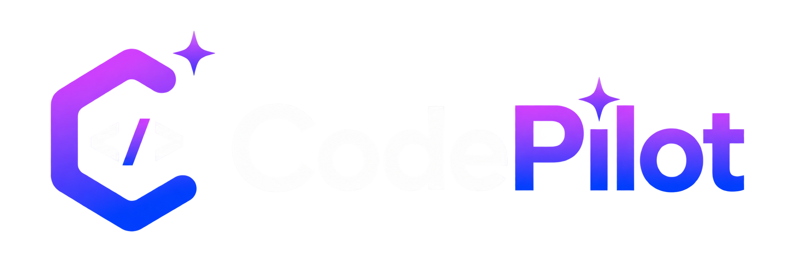
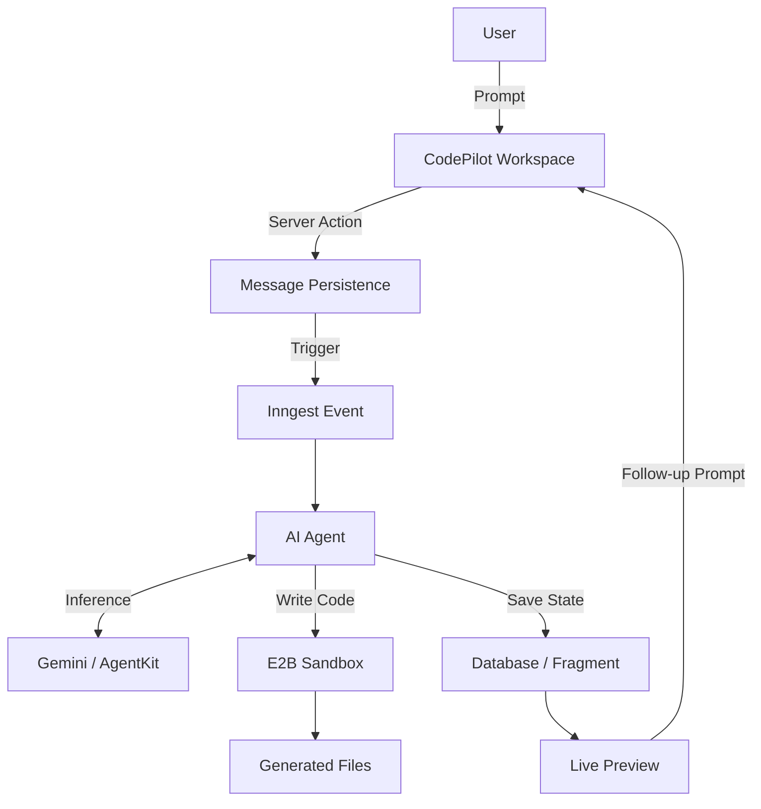

<div align="center">
  

  <h1>CodePilot</h1>

  <p><strong>Build full-stack apps with AI. Just describe what you want.</strong></p>

  <p>CodePilot transforms natural-language ideas into working full-stack applications using an AI coding agent, secure sandbox execution, generated project files, and live previews.</p>
</div>

<hr />

## 🚀 Live Demo

> Live demo link will be added soon.

## 🧠 What is CodePilot?

CodePilot is an AI-powered full-stack application builder. It empowers developers and creators to:
1. **Describe an application** using natural language prompts.
2. **Send the request** to a sophisticated AI coding agent.
3. **Generate application code** dynamically.
4. **Execute the generated project** inside a secure E2B sandbox.
5. **Inspect generated files** and view the running application in real-time.
6. **Continue iterating** through follow-up conversational prompts.

## ⚡ Why CodePilot?

CodePilot bridges the gap between ideas and functional prototypes by leveraging:
- **Natural-language development:** Code by describing what you need.
- **AI-assisted application generation:** Intelligent scaffolding of logic and UI.
- **Full-stack project creation:** Not just frontend components, but complete environments.
- **Automated code execution:** Instantly see the app running without manual setup.
- **Live preview:** Real-time feedback on your generated application.
- **Conversational iteration:** Seamlessly refine and upgrade your app through chat.
- **Developer-friendly workspace:** Integrated code viewer, file explorer, and chat.

## ✨ Features

### 🤖 AI-Powered Development
- Natural language prompts for application design
- AI-powered code generation utilizing Gemini models
- `@inngest/agent-kit` integration for robust multi-step agent workflows

### ⚡ Full-Stack App Generation
- Multi-file project generation and scaffolding
- Project-based development architecture
- Complete generated application structure with Next.js

### 🖥️ Live Preview
- Execute generated applications seamlessly
- Secure E2B sandbox execution environments
- Live application preview directly in the browser

### 💬 Conversational Iteration
- Persistent conversation and project context
- Iterative refinement using follow-up prompts
- Modify generated applications incrementally

### 📁 Developer Workspace
- Interactive file explorer
- Built-in code viewer
- Dedicated project workspace for generated files

### 🔐 Authentication
- Secure user authentication via Clerk

### ⚙️ Background Processing
- Asynchronous task management using Inngest background workflows

## ⚙️ How CodePilot Works



## 🏗️ Architecture

CodePilot uses a modern, scalable tech stack.

### Frontend
- **Next.js (App Router)** for React framework
- **React 19** for UI building
- **TypeScript** for type safety
- **Tailwind CSS v4** for styling
- **shadcn/ui** & **Base UI** for accessible, customizable components
- **React Query** for data fetching and state management

### Backend & Infrastructure
- **Next.js Server Actions & API routes** for backend logic
- **Prisma** for ORM
- **PostgreSQL** for relational database
- **Clerk** for authentication
- **Gemini** & **Groq** for AI models
- **AgentKit** for AI agent orchestration
- **Inngest** for reliable background jobs and workflows
- **E2B** for secure, isolated cloud code execution sandboxes

## 🛠️ Tech Stack

| Category | Technology |
|---|---|
| **Framework** | Next.js (16.3.3 Turbopack) |
| **Frontend** | React 19 |
| **Language** | TypeScript |
| **Styling** | Tailwind CSS v4 |
| **UI Components** | shadcn/ui, Base UI, Radix UI |
| **Database** | PostgreSQL |
| **ORM** | Prisma |
| **Authentication** | Clerk |
| **AI** | Gemini, Groq, AgentKit |
| **Background Jobs** | Inngest |
| **Code Execution** | E2B |
| **Data Fetching** | React Query |

## 📁 Project Structure

```text
src/
├── app/                  # Next.js App Router (Pages, Layouts, API routes)
│   ├── (auth)/           # Clerk authentication routes
│   └── root/             # Main application dashboard and workspace
├── components/           # Reusable UI components
│   ├── brand/            # Logos and branding
│   ├── home/             # Landing page sections
│   ├── projects/         # Workspace, file explorer, chat UI
│   └── ui/               # shadcn/ui components
├── features/             # Feature-based modular logic
│   ├── auth/             # Authentication actions
│   ├── inngest/          # Inngest functions and agent setup
│   ├── messages/         # Chat messages logic
│   └── projects/         # Project management logic
├── generated/            # Prisma generated client
├── lib/                  # Utilities and database clients
└── proxy.ts              # Next.js Middleware (Proxy for Clerk)
```

## 🔄 Core AI Generation Flow

**From Prompt to Application:**

1. **Prompt:** The user submits a natural language description.
2. **User Message:** The message is sent to the workspace UI.
3. **Server Action:** The frontend triggers a secure backend action.
4. **Database:** The prompt is persisted via Prisma to PostgreSQL.
5. **Inngest:** An event is fired, triggering a robust background workflow.
6. **AI Agent:** The CodePilot agent is instantiated using AgentKit.
7. **Code Generation:** The agent leverages Gemini to determine required files and commands.
8. **E2B Execution:** The code is written and executed inside an isolated cloud sandbox.
9. **Generated Files:** The resulting file tree is saved as a project fragment.
10. **Live Preview:** The workspace automatically updates to display the live application and code.

## 🎨 UI / UX

CodePilot is designed with a premium developer-tool interface in mind.
- Sleek dark/light mode integration
- Intelligent AI chat workspace
- Interactive file explorer
- Syntax-highlighted code viewer
- Fully responsive layout
- Subtle micro-interactions and animations

## 🚀 Getting Started

### Prerequisites
- Node.js (v20+)
- npm
- PostgreSQL database
- API Keys for Clerk, Inngest, E2B, and Gemini/Groq

### Installation

Clone the repository and install dependencies:

```bash
npm install
```

### Environment Variables

Create a `.env` file in the root directory and add the following variables based on `.env.example`:

```env
NEXT_PUBLIC_CLERK_PUBLISHABLE_KEY=
CLERK_SECRET_KEY=
NEXT_PUBLIC_CLERK_SIGN_IN_URL=
NEXT_PUBLIC_CLERK_SIGN_IN_FALLBACK_REDIRECT_URL=
NEXT_PUBLIC_CLERK_SIGN_UP_FALLBACK_REDIRECT_URL=
NEXT_PUBLIC_CLERK_SIGN_UP_URL=

DATABASE_URL=

INNGEST_DEV=

E2B_API_KEY=
E2B_TEMPLATE_ID=

GEMINI_API_KEY=
GROQ_API_KEY=
```

### Database Setup

Initialize the Prisma client and push the schema to your database:

```bash
npx prisma generate
npx prisma db push
```

### Running Locally

Start the development server. This will run Next.js and the Inngest local dev server concurrently:

```bash
npm run dev
```

## 📊 Current Status

### ✅ Implemented
- AI-powered code generation with Gemini
- E2B sandbox execution and live preview
- Inngest background agent workflows
- Full-stack project generation
- Interactive file explorer and code viewer
- Clerk authentication

### 🚧 In Progress
- Advanced error recovery and automatic agent debugging

### 🔮 Future Improvements
- Real-time AI streaming responses
- In-browser manual code editing and saving
- Version history and rollback
- One-click deployment to Vercel/Netlify
- GitHub repository integration

## 🛣️ Roadmap

- [x] Initial agent architecture setup
- [x] E2B sandbox integration
- [x] Workspace UI (Chat, File Explorer, Preview)
- [x] Landing page and branding
- [ ] In-browser code editing
- [ ] Automated deployment pipelines

## 🔒 Security & Reliability

- **Clerk Authentication:** Secure user identity and session management.
- **Project Ownership:** Projects are strictly tied to authenticated users.
- **Server-Side Secrets:** API keys are never exposed to the client.
- **E2B Sandbox:** All generated code runs in isolated, temporary environments to prevent malicious execution.
- **Inngest Background Jobs:** Resilient task execution that survives server restarts.

## 💡 Engineering Principles

- **Real functionality over fake UI:** Every button does something real.
- **Secure execution:** Untrusted AI code is always sandboxed.
- **Clean TypeScript:** Strict typing across the stack.
- **Responsive UX:** The workspace adapts to your screen.

## 🤝 Contributing

Contributions are welcome! Please open an issue or submit a pull request if you have ideas for improvements.

## 📜 License

*(No license specified currently)*

---

<div align="center">
  <h3>Build your next application with CodePilot.</h3>
  <p>Describe your idea. Let AI build it. Iterate on the result.</p>
</div>
